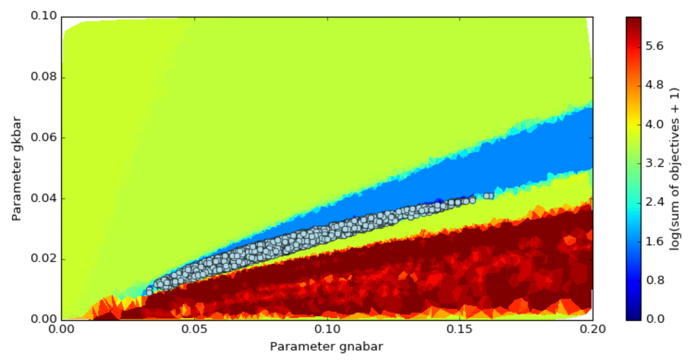

.. BluePyOpt documentation master file, created by
   sphinx-quickstart on Mon May 11 14:40:15 2015.
   You can adapt this file completely to your liking, but it should at least
   contain the root `toctree` directive.

.. include:: ../../README.rst
   :end-before: .. substitutions

.. toctree::
   :maxdepth: 3

   Home <self>
   api.rst

Indices and tables
==================

* :ref:`genindex`
* :ref:`modindex`
* :ref:`search`

.. |banner| image:: /logo/BluePyOptBanner.png

